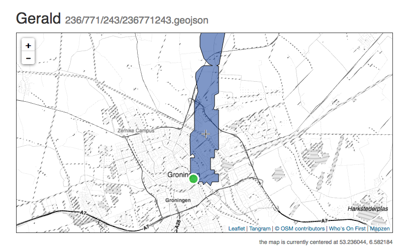

# js-slippymap-crosshairs

Crosshairs. For slippy maps.



## Usage

```
var map = L.map('map');
slippymap.crosshairs.init(map);
```

`slippymap.crosshairs` will do three things:

1. Add a `slippymap-crosshairs` div element as a child of the `map` element, which will draw a set of crosshairs in the center of the map
2. Add a `slippymap-coords` div element as a sibling of the `map` element, which is where the coordinates for the map's current center point will be written
3. Update both things as the window is resize and the map is moved around.

That's it.

By default coordinates are rendered as `latitude`, `longitude` but that can be toggled by clicking the text.

## Caveat

* This should probably be called something like `leaflet.crosshairs`. It might still be.

* It should probably adopt the standard Leaflet `thingy.add(map)` pattern. Some day.

## See also

* http://leafletjs.com/
